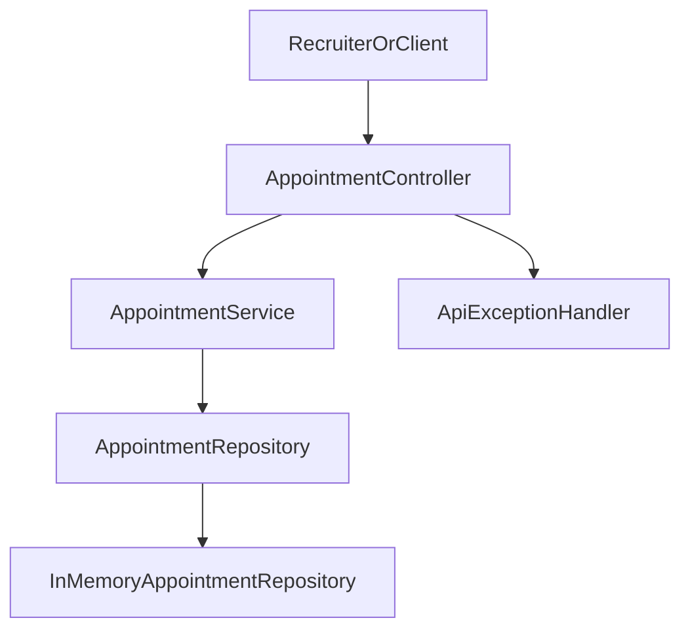

# Backend Showcase

## Zweck

Dieses Beispiel ist kein grosses Produkt, sondern ein bewusst kleines Backend-Artifact fuer Recruiter und Hiring Manager. Es soll schnell pruefbar machen, wie ich Backend-Code strukturiere, fachliche Regeln abbilde und technische Entscheidungen nachvollziehbar halte.

## Was das Beispiel zeigt

- klare Trennung zwischen Web-Layer, Service-Layer und Repository
- saubere REST-Schnittstelle statt reiner Code-Spielerei
- fachliche Regeln im Service statt verteilt im Controller
- strukturierte Fehlerantworten fuer Validierungs- und Fachfehler
- testbare Umsetzung mit Unit- und Integrationstests
- dokumentierbare API ueber OpenAPI/Swagger

## Fachlicher Zuschnitt

Das Showcase bildet eine kleine Appointment-API ab. Das Thema ist absichtlich einfach, eignet sich aber gut, um typische Backend-Anforderungen sichtbar zu machen:

- Eingaben validieren
- Zeitfenster fachlich begrenzen
- ungueltige Termine frueh ablehnen
- Doppelbuchungen fuer denselben Kunden verhindern
- Statuswechsel nachvollziehbar behandeln

## Wichtige Entscheidungen

### Warum Java und Spring Boot

Java sendet fuer mein Profil das staerkste Signal in Richtung deutscher Backend-, Architektur- und Enterprise-Rollen. Spring Boot erlaubt ein kleines, aber professionell lesbares Setup mit bekannten Standards fuer Web, Validation, Tests und API-Dokumentation.

### Warum bewusst klein

Recruiter brauchen keinen grossen Codeberg, sondern einen schnellen Beleg fuer Qualitaet. Ein kompaktes Beispiel mit sichtbaren Regeln, Fehlerbehandlung und Tests liefert meist mehr Signal als ein groesseres, aber schwer ueberschaubares Nebenprojekt.

### Warum In-Memory statt Datenbank

Das Beispiel fokussiert auf API-Design, Business-Logik und Testbarkeit. Eine echte Persistenz waere ein moeglicher naechster Schritt, ist aber fuer den primaeren Recruiting-Nutzen nicht notwendig.

## Architektur

## Relevante Einstiegspunkte

- [`backend/src/main/java/com/wolfgang/showcase/appointment/web/AppointmentController.java`](../backend/src/main/java/com/wolfgang/showcase/appointment/web/AppointmentController.java)
- [`backend/src/main/java/com/wolfgang/showcase/appointment/service/AppointmentService.java`](../backend/src/main/java/com/wolfgang/showcase/appointment/service/AppointmentService.java)
- [`backend/src/main/java/com/wolfgang/showcase/appointment/web/ApiExceptionHandler.java`](../backend/src/main/java/com/wolfgang/showcase/appointment/web/ApiExceptionHandler.java)
- [`backend/src/test/java/com/wolfgang/showcase/appointment/service/AppointmentServiceTest.java`](../backend/src/test/java/com/wolfgang/showcase/appointment/service/AppointmentServiceTest.java)
- [`backend/src/test/java/com/wolfgang/showcase/appointment/web/AppointmentControllerTest.java`](../backend/src/test/java/com/wolfgang/showcase/appointment/web/AppointmentControllerTest.java)

## Aussagekraft fuer Hiring

Dieses Backend soll besonders fuer folgende Rollen Signal geben:

- `Backend Engineer`
- `Software Architect`
- `Integration Engineer`
- seniorige Rollen in fachlich anspruchsvollen oder regulierten Umfeldern

Es zeigt keinen Produktumfang, sondern Arbeitsweise: strukturierte Backend-Entwicklung, testbare Fachlogik, saubere Schnittstellen und klares Engineering-Urteil.
